# Pulsar

Pulsar is a comprehensive, real-time monitoring dashboard for web services and system resources. Built with a Go backend and a React frontend, it provides detailed insights into website uptime, latency, and the performance of the host system.


## Features

- **Website Uptime Monitoring**: Track the status and latency of multiple web services with configurable check intervals.
-   **Detailed Performance Metrics**: Analyze each request with a waterfall breakdown, including DNS lookup, TCP connection, TLS handshake, Time to First Byte (TTFB), and content download times.
-   **System Resource Tracking**: Get a live overview of host system health, including CPU, RAM, and Disk usage, as well as network speed.
-   **Process & Thread Analysis**: Monitor the state of system processes, categorizing them into running, sleeping, and zombie threads to identify potential system overloads.
-   **Real-time Dashboard**: A responsive React interface that visualizes data using sparklines and detailed graphs, updated in real-time via WebSockets.
-   **Asynchronous & Scalable Backend**: A Go backend designed with a separate API and worker process. It uses Redis and Asynq for a robust, concurrent task queueing system.
-   **Type-Safe API**: Communication between the frontend and backend is handled efficiently and safely using Protocol Buffers (Protobuf) and Connect-RPC.
-   **Containerized Environment**: Comes with a `docker-compose` setup for easy, one-command deployment of the entire stack (frontend, backend, worker, database, and message queue).

## System Architecture

Pulsar is composed of several decoupled components that work together to collect, store, and display monitoring data. The backend is split into a synchronous API service and an asynchronous Worker service, which communicate via a Redis-based task queue.

```mermaid
flowchart TD
    %% --- STYLING DEFINITIONS ---
    classDef client fill:#E3F2FD,stroke:#1565C0,stroke-width:2px,color:#0D47A1;
    classDef backend fill:#F3E5F5,stroke:#7B1FA2,stroke-width:2px,color:#4A148c;
    classDef worker fill:#E8F5E9,stroke:#2E7D32,stroke-width:2px,color:#1B5E20;
    classDef infra fill:#FFF3E0,stroke:#EF6C00,stroke-width:2px,color:#E65100;
    classDef external fill:#FFEBEE,stroke:#C62828,stroke-width:2px,stroke-dasharray: 5 5,color:#B71C1C;

    %% --- 1. FRONTEND LAYER ---
    subgraph Client_Side ["💻 Client Side (Frontend)"]
        direction TB
        Browser("Browser / React App"):::client
        ConnectWeb("Connect-Web Client"):::client
    end

    %% --- 2. BACKEND LAYER ---
    subgraph Backend_System ["⚙️ Go Backend System"]
        direction TB

        subgraph API_Layer ["API Services (Sync)"]
            ConnectHandler("Connect-RPC Handler"):::backend
            ServiceLogic("Monitor Service Logic"):::backend
        end

        subgraph Background_Layer ["Background Workers (Async)"]
            Scheduler("⏱️ Scheduler"):::worker
            WorkerPool("👷 Worker Pool"):::worker
        end
    end

    %% --- 3. DATA & INFRA LAYER ---
    subgraph Data_Layer ["🗄️ Persistence & Queues"]
        Postgres[("🐘 PostgreSQL")]:::infra
        Redis[("⚡ Redis")]:::infra
    end

    %% --- 4. EXTERNAL WORLD ---
    subgraph External ["🌐 External World"]
        TargetSites["Target Websites"]:::external
        Discord["📢 Notification"]:::external
    end

    %% --- CONNECTIONS ---

    %% 0. Client Flow
    Browser -- "User Interaction" --> ConnectWeb
    %% 1. Connect
    ConnectWeb -- "POST JSON or Protobuf" --> ConnectHandler

    %% 2. API Flow
    ConnectHandler --> ServiceLogic
    %% 3. DB Write
    ServiceLogic -- "sqlc Write/Read" --> Postgres

    %% 4. Scheduler DB Check
    Scheduler -- "1. Check Due Monitors" --> Postgres
    %% 5. Scheduler Redis Enqueue
    Scheduler -- "2. Enqueue Task" --> Redis

    %% 6. Worker Redis Dequeue
    Redis -.->|3. Dequeue Task| WorkerPool

    %% 7. Worker Ping
    WorkerPool -- "4. HTTP GET Ping" --> TargetSites
    %% 8. Worker DB Write
    WorkerPool -- "5. Write Result" --> Postgres
    %% 9. Worker Alert
    WorkerPool -.->|"6. Alert if Down"| Discord

    %% --- LINK STYLING (Corrected Indices) ---
    %% Blue Links (Database Access: 3, 4, 8)
    linkStyle 3,4,8 stroke:#1565C0,stroke-width:2px;

    %% Orange Links (Redis Access: 5, 6)
    linkStyle 5,6 stroke:#EF6C00,stroke-width:2px;

    %% Red Links (External: 7, 9)
    linkStyle 7,9 stroke:#C62828,stroke-width:2px;
```



1.  **Frontend (React)**: The user interacts with the UI, which uses a Connect-Web client to send RPC requests to the API. It also maintains a WebSocket connection for real-time updates.
2.  **API Service (Go)**: Handles synchronous requests like creating or deleting monitors. It publishes live system and monitor updates received from Redis to all connected WebSocket clients.
3.  **Scheduler (Go Worker)**: Periodically queries the PostgreSQL database to find monitors that are due for a check.
4.  **Task Queue (Redis + Asynq)**: The Scheduler enqueues ping tasks into a Redis queue managed by Asynq.
5.  **Worker Pool (Go Worker)**: A pool of concurrent workers dequeues tasks. Each worker performs an HTTP request with detailed tracing to the target URL.
6.  **System Monitor (Go Worker)**: A separate goroutine in the worker collects host system statistics (CPU, memory, etc.) and publishes them to a Redis Pub/Sub channel.
7.  **Persistence (PostgreSQL)**: The worker saves the result of each ping, including latency and waterfall timings, to the database.

## Technology Stack

-   **Backend**: Go, Connect-RPC, Asynq, `pgx/v5`, `gopsutil`, Gorilla WebSocket
-   **Frontend**: React, TypeScript, Vite, Tailwind CSS, Recharts, Lucide Icons, Connect-Web
-   **API Definition**: Protocol Buffers (Protobuf)
-   **Database**: PostgreSQL
-   **Queue & Pub/Sub**: Redis
-   **Containerization**: Docker, Docker Compose

## 🚀 Installation & Setup (From Scratch)
Follow these steps to set up and run Pulsar from scratch on your local machine.

### Prerequisites
* [Docker](https://www.docker.com/) &5 Docker Compose
* [Go](https://go.dev/) (1.24+)
* [Node.js](https://nodejs.org/) (20+)

### 1. Clone the Repository
```bash
git clone [https://github.com/barkinrl/pulsar.git](https://github.com/barkinrl/pulsar.git)
cd pulsar
```
### 2. Install Dependencies (Optional for Local Dev)
If you want to run the code locally without Docker, install the dependencies first:
```bash
# Backend Dependencies
go mod download

# Frontend Dependencies
cd web
npm install
cd ..
```

### 3. Run via Docker Compose (Recommended)
The fastest way to get Pulsar running is using Docker Compose. This starts PostgreSQL, Redis, Backend, Worker, and Frontend services simultaneously.
```bash
# Build and start services in the background
docker-compose up -d

# View logs to ensure everything is running
docker-compose logs -f
```
Once up, access the application at:
- Frontend (UI): `http://localhost:5273`

- Backend API: `http://localhost:8080`

## Deployment (AWS EC2 & Docker Hub)
This guide covers deploying Pulsar to a Linux server (e.g., AWS EC2) using Docker Hub.

### 1. Build & Push Images (Multi-Arch Support)
Since servers usually run on AMD64 architecture, you must build the images specifically for that platform (especially if you are on an Apple Silicon Mac).

```bash
# 1. Set your Docker Hub username
export DOCKER_USER="your_dockerhub_username"

# 2. Login to Docker Hub
docker login

# 3. Build & Push Backend (AMD64)
docker build --platform linux/amd64 -t $DOCKER_USER/pulsar-backend:latest -f Dockerfile .
docker push $DOCKER_USER/pulsar-backend:latest

# 4. Build & Push Worker (AMD64)
docker build --platform linux/amd64 -t $DOCKER_USER/pulsar-worker:latest -f Dockerfile .
docker push $DOCKER_USER/pulsar-worker:latest

# 5. Build & Push Frontend (AMD64)
cd web
docker build --platform linux/amd64 -t $DOCKER_USER/pulsar-frontend:latest .
docker push $DOCKER_USER/pulsar-frontend:latest
cd ..
```
### 2. Server Setup (EC2)
Connect to your server via SSH and create the necessary configuration files.

**Step A:** Create `init.sql` Copy the content of your local init.sql to the server to initialize the database schema.

**Step B:** Create a `docker-compose.yml` file on your server. 

Ensure you:

1. Update the `image` fields with your Docker Hub username.

2. Update the `VITE_API_URL` environment variable with your server's **Public IP**.

```YAML
version: "3.8"
services:
  # ... postgres & redis configs ...
  
  backend:
    image: your_username/pulsar-backend:latest
    # ... env vars ...

  worker:
    image: your_username/pulsar-worker:latest
    # ... env vars ...

  frontend:
    image: your_username/pulsar-frontend:latest
    environment:
      - VITE_API_URL=http://YOUR_SERVER_PUBLIC_IP:8081
    ports:
      - "3001:5173"
```
**Step C:** Start the System
```bash
# Pull the latest images and start
docker-compose pull
docker-compose up -d
```
**Step D:** Network Configuration Ensure your cloud provider's firewall (e.g., AWS Security Groups) allows inbound traffic on:

- **Port 3001:** For Frontend access.

- **Port 8081:** For Backend API access.
# Project Structure
```
pulsar/
├── cmd/                # Entry points (Main applications)
│   ├── api/            # API Server (Backend)
│   │   └── main.go
│   └── worker/         # Background Worker
│       └── main.go
├── gen/                # Generated Code (Protobuf -> Go/TS)
├── internal/           # Private application logic
│   ├── api/            # WebSocket Hub & Handlers
│   ├── db/             # SQLC generated DB code
│   ├── service/        # Business Logic (RPC impl)
│   └── worker/         # Task Handlers (Ping logic)
├── proto/              # Protocol Buffer definitions (.proto)
├── web/                # Frontend Application (React)
│   ├── src/
│   │   ├── gen/        # Generated TS Clients
│   │   ├── components/ # Widgets, Charts, Sliders
│   │   └── lib/        # API Clients
│   └── Dockerfile      # Frontend specific Dockerfile
├── docker-compose.yml  # Local & Prod Orchestration
├── Dockerfile          # Backend & Worker Multi-stage build
├── init.sql            # Database Schema
├── go.mod              # Go dependencies
└── README.md           # Documentation
```
