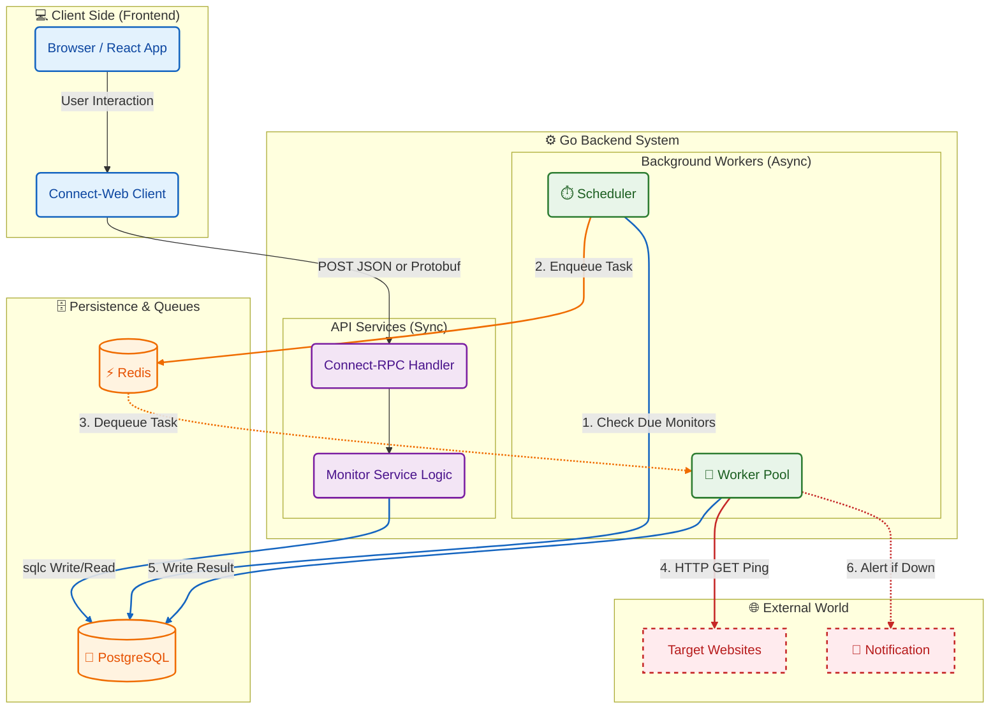

```mermaid
flowchart TD
    %% --- STYLING DEFINITIONS ---
    classDef client fill:#E3F2FD,stroke:#1565C0,stroke-width:2px,color:#0D47A1;
    classDef backend fill:#F3E5F5,stroke:#7B1FA2,stroke-width:2px,color:#4A148c;
    classDef worker fill:#E8F5E9,stroke:#2E7D32,stroke-width:2px,color:#1B5E20;
    classDef infra fill:#FFF3E0,stroke:#EF6C00,stroke-width:2px,color:#E65100;
    classDef external fill:#FFEBEE,stroke:#C62828,stroke-width:2px,stroke-dasharray: 5 5,color:#B71C1C;

    %% --- 1. FRONTEND LAYER ---
    subgraph Client_Side ["💻 Client Side (Frontend)"]
        direction TB
        Browser("Browser / React App"):::client
        ConnectWeb("Connect-Web Client"):::client
    end

    %% --- 2. BACKEND LAYER ---
    subgraph Backend_System ["⚙️ Go Backend System"]
        direction TB

        subgraph API_Layer ["API Services (Sync)"]
            ConnectHandler("Connect-RPC Handler"):::backend
            ServiceLogic("Monitor Service Logic"):::backend
        end

        subgraph Background_Layer ["Background Workers (Async)"]
            Scheduler("⏱️ Scheduler"):::worker
            WorkerPool("👷 Worker Pool"):::worker
        end
    end

    %% --- 3. DATA & INFRA LAYER ---
    subgraph Data_Layer ["🗄️ Persistence & Queues"]
        Postgres[("🐘 PostgreSQL")]:::infra
        Redis[("⚡ Redis")]:::infra
    end

    %% --- 4. EXTERNAL WORLD ---
    subgraph External ["🌐 External World"]
        TargetSites["Target Websites"]:::external
        Discord["📢 Notification"]:::external
    end

    %% --- CONNECTIONS ---

    %% 0. Client Flow
    Browser -- "User Interaction" --> ConnectWeb
    %% 1. Connect
    ConnectWeb -- "POST JSON or Protobuf" --> ConnectHandler

    %% 2. API Flow
    ConnectHandler --> ServiceLogic
    %% 3. DB Write
    ServiceLogic -- "sqlc Write/Read" --> Postgres

    %% 4. Scheduler DB Check
    Scheduler -- "1. Check Due Monitors" --> Postgres
    %% 5. Scheduler Redis Enqueue
    Scheduler -- "2. Enqueue Task" --> Redis

    %% 6. Worker Redis Dequeue
    Redis -.->|3. Dequeue Task| WorkerPool

    %% 7. Worker Ping
    WorkerPool -- "4. HTTP GET Ping" --> TargetSites
    %% 8. Worker DB Write
    WorkerPool -- "5. Write Result" --> Postgres
    %% 9. Worker Alert
    WorkerPool -.->|"6. Alert if Down"| Discord

    %% --- LINK STYLING (Corrected Indices) ---
    %% Blue Links (Database Access: 3, 4, 8)
    linkStyle 3,4,8 stroke:#1565C0,stroke-width:2px;

    %% Orange Links (Redis Access: 5, 6)
    linkStyle 5,6 stroke:#EF6C00,stroke-width:2px;

    %% Red Links (External: 7, 9)
    linkStyle 7,9 stroke:#C62828,stroke-width:2px;
```
